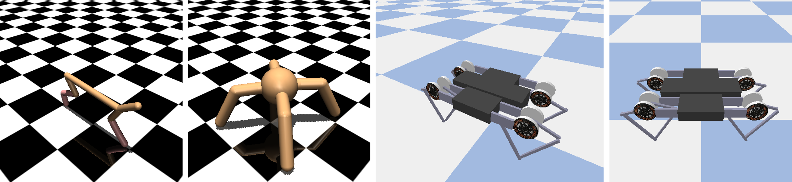

## Diverse Open Loop Motion Control Based on Latent Space of Action Sequence
 
- ## Framework
  

- ## Motion Control Task: 
  

- ## Trajectory Generator Output: 
  

- ## Experiment: Diversity in Motion Direction and Velocity
  (Different colors represent different latent variables)
  

- ## Experiment: HalfCheetah Diverse Motion Posture
  

- ## Experiment: Ant Diverse Motion Direction
  
  
  (Gif, select latent variable z∈[-2,2])
  
  
